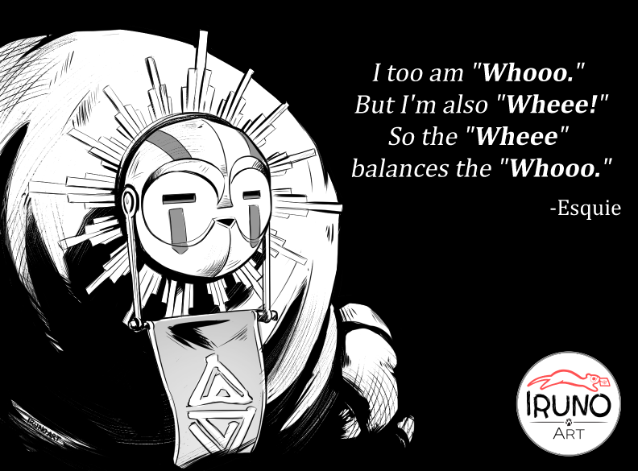

<h1 align="center">
  
   
  Nixpedition
   
</h1>

<h4 align="center">
  A set of personal NixOS configuration files built using the <a href="https://github.com/mightyiam/dendritic" target="_blank">Dendritic pattern</a>.
</h4>

  
  
  

  <a href="#screenshots">Screenshots</a> •
  <a href="#credits--attributions">Credits & Attributions</a> •
  <a href="#license">License</a>

  

> [!IMPORTANT]
> **Disclaimer:** This is by no means a "community framework" or "NixOS distribution" - please do not use it like one.
> This is a personal configuration full of unspeakable and over-engineered hackery that makes even me go **"WheeWhooWheeWhoo"** sometimes.

## Screenshots

_(screenshots coming soon)_

## Credits & Attributions

Special thanks to:
- [@Wittano](https://github.com/Wittano) — For introducing me to NixOS. Thanks to him I now spend more time tweaking my configuration than touching grass...
- [@Th0rgal](https://github.com/Th0rgal) — Creator of the [NixOS logo](https://github.com/NixOS/nixos-artwork/issues/50) used here.
- [@IrunoArt](https://x.com/IrunoArt) — Artist of the amazing [Esquie artwork](https://x.com/IrunoArt/status/1920161707412029899).

## License

Distributed under the MIT license. See the [LICENSE](LICENSE) file for more information.
